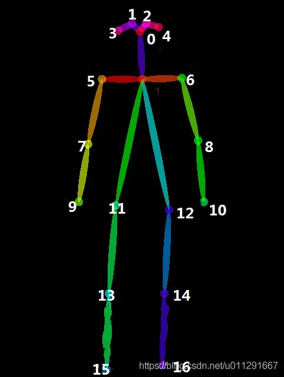

# Human pose label tool COCO
## Quick Start
```
python label_tool.py
```
## Usage tips
Use mouse to click 18 keypoints in order(provided below). After all 18 keypoints are clicked, the result would be shown.
* If you fail and want to restart, press "backspace".  
* If you want a break, press "Escape".
* Simply rerun the command to continue.

## Keypoints
The order of labeling is as follows:

